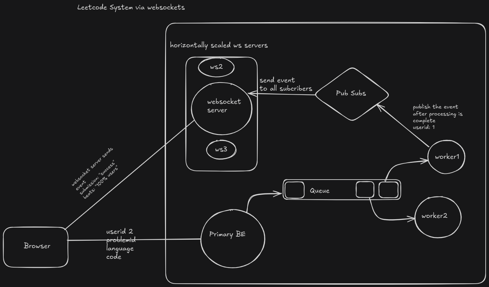

# Implemented an architecture similar to leetcode (except it uses persistant connection between browser and web socket server rather than polling server for response after submission)

### Used redis to manage queues, pub-sub 

